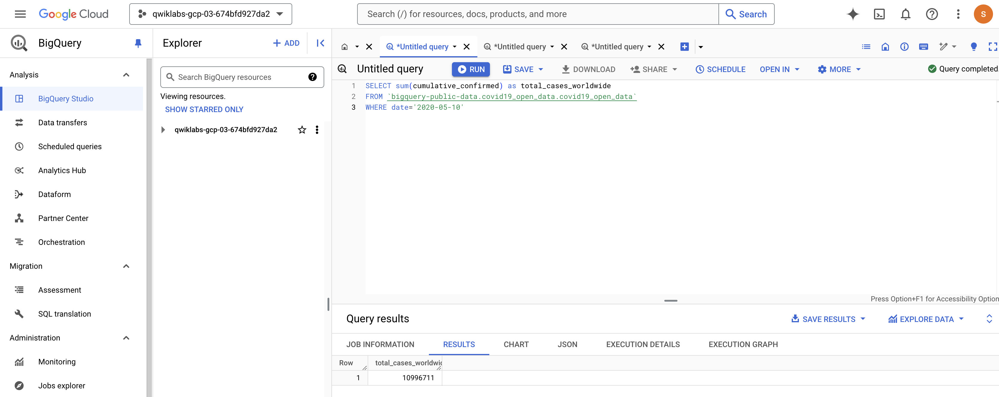
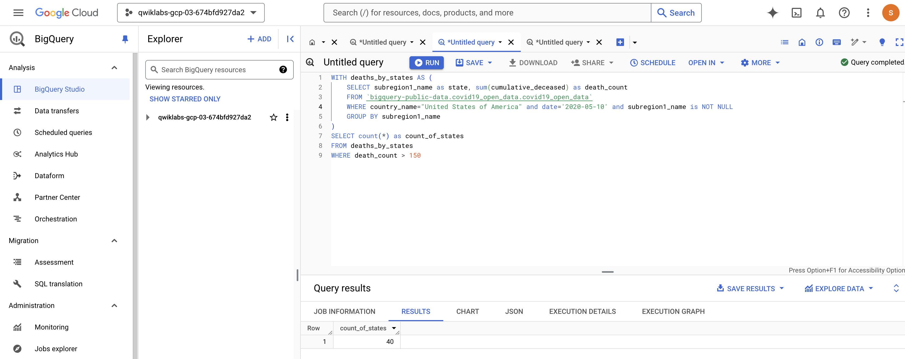
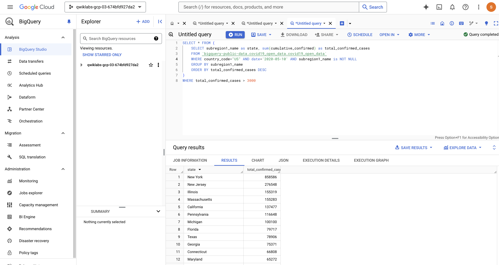
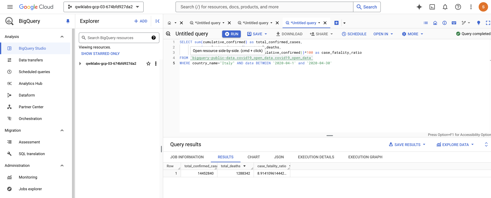
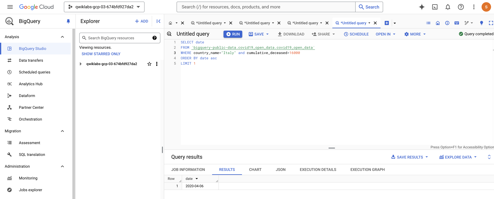
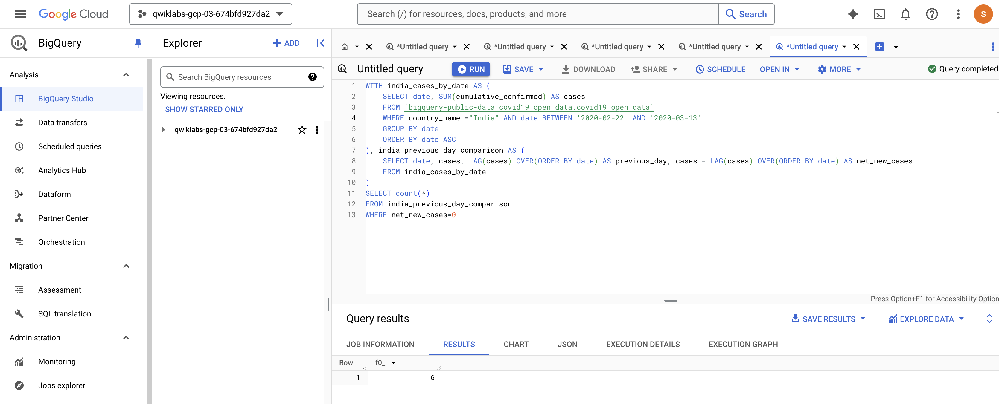
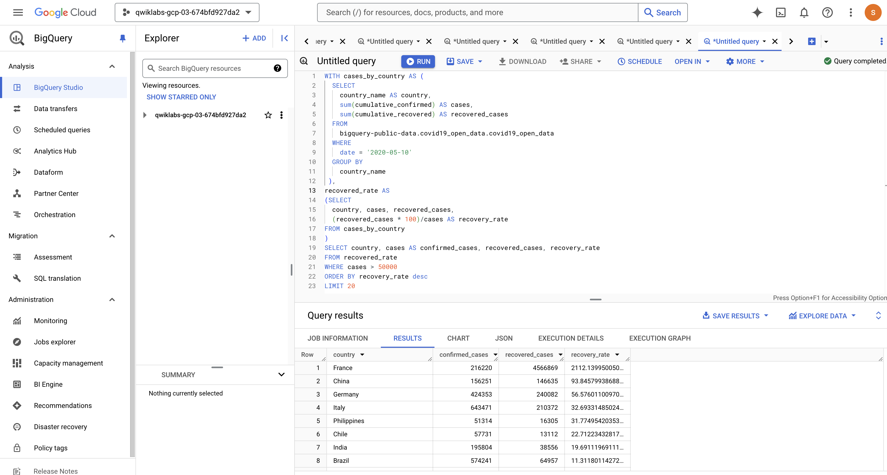
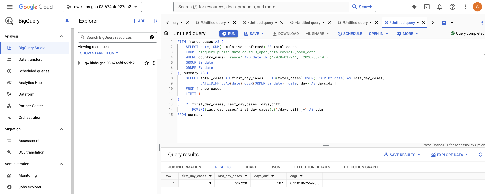
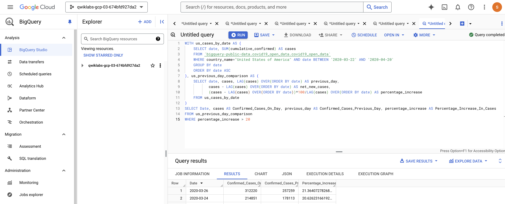
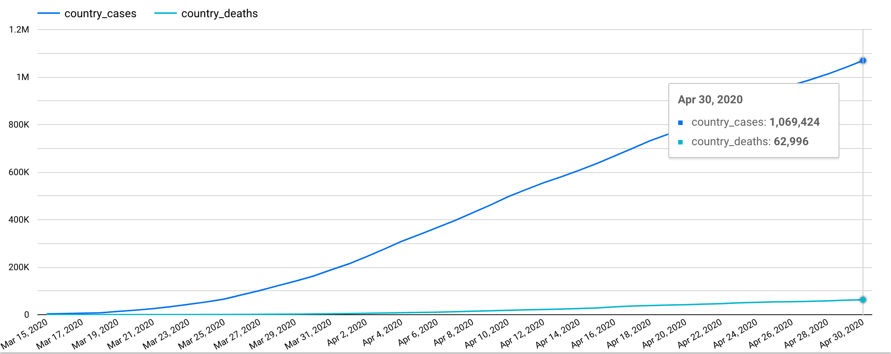

### **Derive Insights from BigQuery Data: Challenge Lab**

---

### **Overview**

This lab will challenge you to use BigQuery to perform COVID-19-related queries. The tasks focus on identifying key pandemic data insights.

---

### **Task 1: Total Confirmed Cases**

**Query:** The total count of confirmed cases worldwide.

* The query results for the **total_cases_worldwide** output.

### **Task 2: Worst Affected Areas**

**Query:** Number of U.S. states with more than a certain number of deaths.

* After showing the output for  **count_of_states**

### **Task 3: Identifying Hotspots**

**Query:** List of U.S. states with more than a certain number of confirmed cases.

* After the query displays the **state** and **total_confirmed_cases** in descending order.

### **Task 4: Fatality Ratio**

**Query:** Case-fatality ratio for Italy in a specific month.

* After showing the results for  **total_confirmed_cases** ,  **total_deaths** , and  **case_fatality_ratio**

### **Task 5: Identifying Specific Day**

**Query:** Date when Italy’s death count crossed a specific threshold.

* After showing the date result in the format  **yyyy-mm-dd** .

---

### **Task 6: Finding Days with Zero Net New Cases**

**Updated Query:** Correct the provided query to return the proper output.

* After displaying the correct number of days with zero increases in confirmed cases.

### **Task 7: Doubling Rate**

**Query:** Dates in the U.S. where cases increased by more than a certain percentage.

* After showing the list of dates with  **Confirmed_Cases_On_Day** ,  **Confirmed_Cases_Previous_Day** , and  **Percentage_Increase_In_Cases** .

### **Task 8: Recovery Rate**

**Query:** List of recovery rates for countries with over 50K confirmed cases.

* After displaying the fields  **country** ,  **recovered_cases** ,  **confirmed_cases** , and  **recovery_rate** .

### **Task 9: CDGR (Cumulative Daily Growth Rate)**

**Corrected Query:** Fix the query to calculate France’s CDGR.

* After the query calculates the correct values for France's  **CDGR**

### **Task 10: Create a Looker Studio Report**

**Report Requirements:** Plot U.S. confirmed cases and deaths over a date range (***2020-03-22 to 2020-04-20***)

* The looker report would look similar to this.

